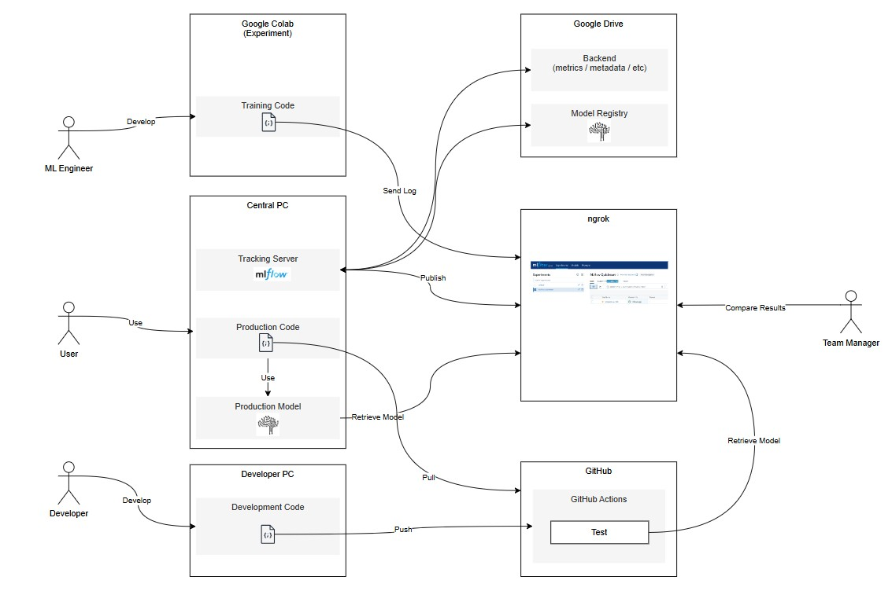
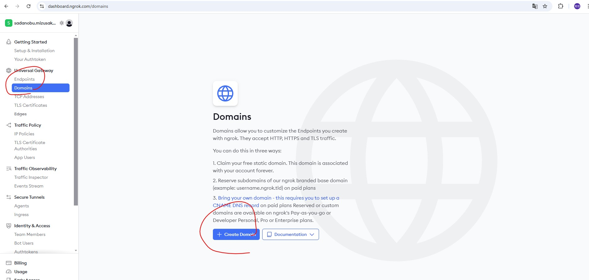
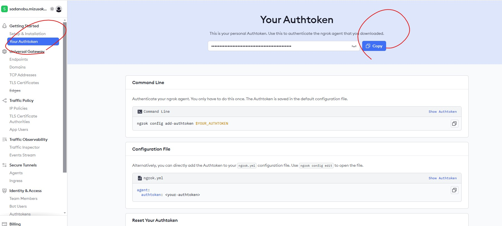
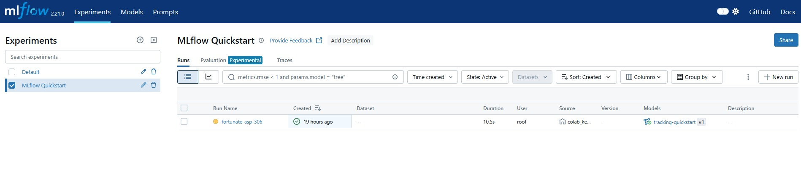

# Overview
## Motivation
- Want to create a simple and low cost MLOps env

## Requirements
- As a model developer, I want to manage experiment results and compare them. So I can find a suitable model config.
- As a team manager, I want to refer the experiment results by all members in a single view. So I can select a suitable model to implement.
- As a CICD developer, I want to have a model registory. So I can retrieve the identical model from any where.
- As a team manager, I do not want to use a paid service as much as possible. So I can save the team budget.
- As a team manager, I do not want anyone outside of the team to access our resources. So I can keep our invention private.

## Architecture
- **mlflow**: machine learning workflow manegemnt
- **google colab**: model development and experiment
- **google drive**: backend and model registory
- **central pc**: tracking server and proruction env
- **developer pc**: development env
- **ngrok**: enabling public access the mlflow ui hosted in local env
- **github / github actions**: code and CICD management




## Limitation
- **ngrok** provides only one URL for a free plan

## Alternatives
- **DagsHub**: Has free plan but allows up to 100 runs
- **Databricks Communiy Edition**: Does not support remote option

# Usage
## 0. Prerequisites
- Signed up [ngrok](https://ngrok.com/).
- Domain is created via ngrok.

- Python and [uv](https://docs.astral.sh/uv/) are installed in Central PC.
- google drive app is installed in Central PC.

## 1. Launch Tracking Server (Central PC)
### clone repo
```bash
git clone https://github.com/MizusakoSadanobu/mlflow_ngrok_integration.git
```

### set up uv
```bash
uv sync
```

### activate virtual env
```
.\.venv\Scripts\activate
```

### move to Google Drive
Before run the mlflow server, move to the directory where is syncronized with Google Drive (such as "H:\My Drive\MLflow").
```
cd "H:\My Drive\MLflow"
```

### launch server
```
mlflow server --backend-store-uri sqlite:///my.db  --host 0.0.0.0  --port 5000 --app-name basic-auth
```

You may see an error message that says as follows:
> mlflow.exceptions.MlflowException: A static secret key needs to be set for CSRF protection. Please set the `MLFLOW_FLASK_SERVER_SECRET_KEY` environment variable before starting the server. For example: export MLFLOW_FLASK_SERVER_SECRET_KEY='my-secret-key'

If you are using powershell, run the following command.
```bash
$env:MLFLOW_FLASK_SERVER_SECRET_KEY='my-secret-key'
```

### publish your env
```bash
uv run python publish_localhost
```
Then input `ngrok_access_token` and `domain_name`.
- `ngrok_access_token` is copied from the `Your Authtoken` tab.

- `domain_name` is displayed in the `Domains` tab.

### change password
Once publish your local host via ngrok, change the default password as soon as possible. In the original directory, run the script:
```bash
uv run python change_admin_password.py
```
Input `domain_name` `current_password` `new_password`.
- If it is the first time to run the script, the current password should be the default one, `password`.

## 2. Develop and Store ML model (Google Colab)
### Run the model development code with MLflow
Run the [test_tracking.ipynb](./test_tracking.ipynb) in your google colab.

### check if MLflow tracks your experiments
You should be able to access the MLflow UI via "https//`domain_name`".



## 3. Develop Code (Developer PC)
### update the code
- create a new branch for the update
- update the code
- push the code to your repo

### check if the test succeeded in GitHub Actions

### merge the branch into main branch

## 4. Implement Code (Central PC)
### pull the latest update from main branch